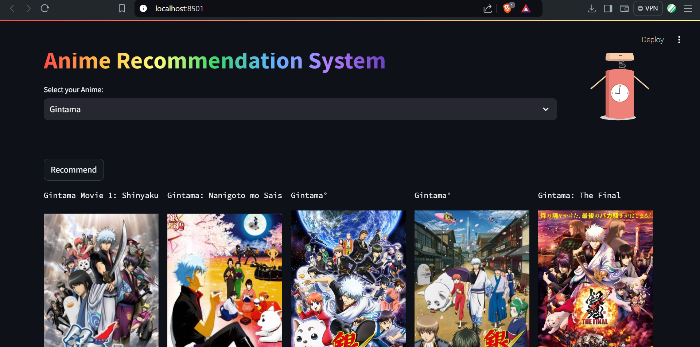

This paper presents a comprehensive overview of an anime recommendation system that integrates collaborative filtering, content-based filtering, and hybrid approaches to provide personalized suggestions. Collaborative filtering utilizes user behavior and preferences to identify similarities and recommend anime based on the tastes of similar users. Content-based filtering focuses on analyzing the attributes of anime, such as genres, themes, and character traits, to match users with content that aligns with their interests. 

The anime recommendation system aims to help users discover anime that suits their personal tastes and preferences by providing tailored recommendations. It enhances user experience by suggesting content that aligns with individual interests, increasing content discovery, and adapting to evolving preferences.

### 📺Website View

